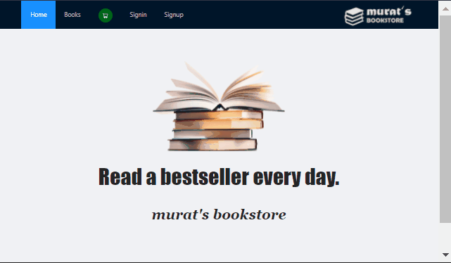

## MERN Stack (Front to Back 👍) Bookstore
This is a **MERN stack** (MongoDB Express React Node) example app, that I created for training purposes. It is an online book store Web Application.

##### Website Demo on Heroku --> [Murat's Bookstore](https://node-mongo-booktest.herokuapp.com/)

## Table of contents

1. [ Motivation ](#motivation)
2. [ Features ](#features)
3. [ Structure ](#structure)
4. [ Screenshots ](#screenshots)
5. [ Tech/framework used](#framework)
6. [ Contribute ](#contribute)
7. [ License ](#license)

<a name="motivation"></a>

## Motivation
In order to develop my software skills and as a part of my education I developed this web application. It is an online book store where you can add various books to your basket and pay through stripe.

<a name="features"></a>

## Features of the web application
- register, login, password reset
- form validation, password encryption
- product listing, filtering,
- cart, payment (with stripe)

<a name="structure"></a>

## Structure


##### Front End - React.js
I used React to build the client side of the Application. React lets you build up interfaces through simple Components, connect them to data on your backend server, and render them as HTML.

##### Server Tier - Express.js and Node.js
With Express.js framework, running inside a Node.js server, app handles the HTTP requests and responses. It responds the GET and POST requests, made by React.js client.

##### Database Tier - MongoDB
The data for the application such as user info and item info is stored in MongoDB. By means of solutions like Mongoose, MongoDB can easily communicate with server, save or send data in JSON format.

<a name="screenshots"></a>

## Screenshots




<a name="framework"></a>

## Library, frameworks, tools etc. used

- [MongoDB](https://www.mongodb.com/)
- [Express](https://expressjs.com/)
- [React](https://reactjs.org/)
- [NodeJS](https://nodejs.org/)
- [Mongoose](https://mongoosejs.com/)
- [Antdesign](https://ant.design/)
- [Jsonwebtoken](https://www.npmjs.com/package/jsonwebtoken)
- [Axios](https://axios-http.com/)
- [Stripe](https://stripe.com/docs/development)


<a name="contribute"></a>

## Contribute
I will be happy to see your contributions.

<a name="license"></a>

## License

MIT © [Murat]()


---

```
mern-stack-app
├── client
│     └── src
│         ├── App.js
│         ├── index.js
│         ├── components
│         ├── context
│         ├── helper
│         ├── pages
│         └── router
├── server.js
├── controllers
├── middleware
├── models
└── routes
```


